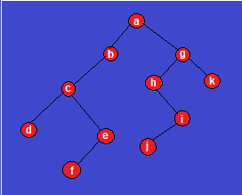

Question Setter
---------------
Name:  **Replace me with your name keeping the bold formatting**         
Registration # **Replace me with your registration number keeping the bold formatting**            
Session: *Replace me with your session keeping the italic formatting*            
GitHub Username: *Replace me with your GitHub Username keeping the italic formatting*               
Cell: *Replace me with your mobile number(s) keeping the italic formatting*              
Email: *Replace me with your email id(s) keeping the italic formatting*         

Question Set with Answers
=========================
<div style="text-align:center">
<<<<<<< Updated upstream
  <style>
    #marking {
        display: flex;
        margin: 0;
        padding: 0;
    }
    .alignleft {
        flex: 1;
        text-align: left;
    }
    .aligncenter {
        flex: 1;
        text-align: center;
    }
    .alignright {
        flex: 1;
        text-align: right;
=======
  <div align="center">Shahjalal University of Science and Technology
  </div>   
  <div align = "center">Department of Computer Science and Engineering
  </div>  
  <div align = "center"><span> 1<sup>st</sup> Year 1<sup>st</sup> Semester Final Examination &mdash;
  June 2020 (Session 2019-20) </span></div>  
  <br>
  <div align = "center"> Course No. &mdash; <b> CSE 137</b> </div>  
  <div align="center"> Course Title &mdash; <b> Data Structers </b> </div>
  <br>
  <div align = "center">
    Time &mdash; <b> 3 Hours</b>&emsp;&emsp;&emsp;&emsp;&emsp;&emsp;&emsp;&emsp;&emsp;&emsp;&emsp;Credit:<b> 3.00</b>&emsp;&emsp;&emsp;&emsp;&emsp;&emsp;&emsp;&emsp;&emsp;&emsp;&emsp;Total Marks # <b> 100</b>
    </div><br>
    <div align = "center">(Answer all the questions)</div></div>
<div align="center"><h4>Group A</h4></div>
<div style="text-align:left">1. Answer the following Questions in short. (Any <b>Five</b>).</div>
<div align="right">5 &times; 2 = 10 </div>

(a) What does the following function do for a singly linked list? Explain in short.
```cpp
int fun(int val)
{
	Node temp = head;
	int x = 0;
	while(temp != null)
	{
		if(temp.data == val)
			return x;
		x+=1;
		temp = temp.next;
	}
	return INT_MIN;
}
```
**Short Answer:** <br>
Find and return the position of the given element from the linked list.

(b) In which type of linked list last node of the list points to the first node of the list? How to create a new node for the linked list using malloc. <br>

**Answer:** <br>
1. Circular linked list. <br>
2. ```struct NODE *newNode = (NODE*)malloc(sizeof(NODE));```

( c) If you represnt a binary tree of 20 nodes using linked representation then how many null pointers will there be? What is the main difference between BT and BST?

**Answer:**<br>
1. 20+1=21 null pointers.<br>
2. In BST the values of left subtree of a particular node should be lesser than that node and the right subtree values should be greater. BUT in BT there is no required organization structure of the nodes in the tree.

(d) When does Underflow of Stack occurs? If an user pushes 1 element in the stack having ten elements then the stack becomes_______. (stack size is 10).

**Answer:**<br>
i) If user tries to remove element from an empty stack.<br>
ii) Overflowed.

(e) What is a bipartite graph? Explain visually.

**Answer:**<br>
a bipartite graph is a graph whose vertices can be divided into two disjoint and independent sets U and V such that every edge connects a vertex in U to one in V.<br>
<div align="center"></div>
<div align="center"> A Bipartite graph </div> <br>

(f) How many binary trees can be generated using 7 nodes? How many of them will have maximum heights?

**Answer:**<br>
i) (2n<sub>C</sub><sub>n</sub>)/(n+1) = (14<sub>C</sub><sub>7</sub>)/(7+1) = 429.<br>
ii) 2<sup>n-1</sup> = 2<sup>7-1</sup> = 64.

(g) **Make pairs of the words:** FIFO, stack, queue, LIFO.<br> Suppose, your school team is going to perform on stage. At the very beginning of the performance there is a bench at the center of the stage. Some of the performers will stand at the right side of the bench and some at the left. After 10 seconds some performers from the right and some from the left will go to the backstage (not all of them). Imagining the situation, one of your friends says that this is like a certain data structure where joining and leaving of the students are like operations on the data structure. Which DS is it? What are the operations?

**Answer:** <br>
i) {FIFO, stack}, {LIFO, queue}.<br>
ii) Dequeue. push_back(), push_front(), pop_back(), pop_front().

(h) Compare the advantage and disadvange of adjacency list and adjacency matrix.

**Answer:**<br>
i) Space complexity of adjacency matrix is O(v<sup>2</sup>) while adjacency list takes O(V + E) spaces only.<br>
ii) Querying requires O(1) time complexity for adjacency matrix while it is O(V) for the adjacency list.

<div align="left">2. Answer the following Questions. (Any <b>Four</b>).</div>
<div align="right">4 &times; 5 = 20 </div>

(a) Write down a simple code (or pseudo-code or functions) using recursion to find out whether a BT is BST or not.

**Answer:**<br>
```cpp
bool isBST(Node* cur, int min, int max)
{
    if (cur == NULL)
        return true; // base case
    else if (cur->data > max || cur->data < min)
        return false; // checking if the node satisfies the property of BST
    return isBST(cur->left, min, cur->data) &&
           isBST(cur->right, cur->data, max); // recursion using the property of BST
}

void isBST(Node* root)
{
    if (isBST(root, LLONG_MIN, LLONG_MAX))
        cout << "BST";
    else
        cout << "not BST";
}
```

(b) Write a function to delete all the duplicates from a linked list. The list will contain only **positive** integers from **1 to 10<sup>6</sup>**.

**Answer:**<br>
We can use hashing technique to implement the function.
```cpp
bool check[1000000]={0};

void delDups(Node* head)
{
    Node* prev = NULL;
    Node* temp = head;
    while (temp != nullptr)
    {
        if (check[temp->data])
            prev->next = temp->next;
        else
        {
            check[temp->data] = 1;
            prev = temp;
        }
        temp = prev->next;
    }
}
```
>*If the list contained negative integers then we could use set data structure for hashing.

( c) Write down the best and worst time complexities for the given sort algorithms.<br>
i) Selection sort.
ii) Heap sort.
iii) Quick sort.
iv) Merge sort.

**Answer:**<br>
i) **best:** Ω(n<sup>2</sup>) **worst:** O(n<sup>2</sup>)<br>
ii) **best:** Ω(n log(n)) **worst:** O(n log(n))<br>
iii) **best** Ω(n log(n)) **worst** O(n<sup>2</sup>)<br>
iv) **best:** Ω(n log(n)) **worst:** O(n log(n))<br>

(d) Write down two seperate function to print the nodes of a binary tree in post- order and in- order method.

**Answer:**<br>
1.
```cpp
void PostOrder(Node *t)
{
  if(t != NULL)
  {
    PostOrder(t->lChild);
    PostOrder(t->rChild);
    cout << t->data << " ";
  }
}
```
2.
```cpp
void inOrder(Node *t)
{
  if(t != NULL)
  {
    inOrder(t->lChild);
    cout << t->data << " ";
    inOrder(t->rChild);
  }
}
```

(e) Sort an array using Quick sort algorithm in ascending order.

**Answer:** <br>
```cpp
#include <stdio.h>

static inline
void swap(int *a, int *b)
{
    int temp = *a;
    *a = *b;
    *b = temp;
}

static
int partition(int *L, int left, int right)
{
    int pivot = left;
    int p_val = L[pivot];

    while (left < right)
    {
        while (L[left] <= p_val)
            left++;
        while (L[right] > p_val)
            right--;
        if (left < right)
            swap(&L[left], &L[right]);
    }
    swap(&L[pivot], &L[right]);
    return right;
}

static
void qSort(int *L, int start, int end)
{
    if (start >= end)
        return;
    int splitPoint = partition(L, start, end);
    qSort(L, start, splitPoint - 1);
    qSort(L, splitPoint + 1, end);
}

static void print_array(int *ptr, int left, int right)
{
    for (int i = left; i <= right; i++)
        printf("%3d ", ptr[i]);
    puts("");
}

int main(void)
{
    int arr[] = {12, 43, -16, 0, 2, 5, 1, 13, 2, 2, -1};
    qSort(arr, 0, 9);
    puts("Sorted Array:");
    print_array(arr, 0, 9);
}
```

(f) Generate all the binary numbers from 1 to n using queue data structure. (You can use queue from STL).

**Answer:**<br>
```cpp
#include <bits/stdc++.h>
using namespace std;

void biNumTillN(int n)
{
    queue<string> q;
    q.push("1");
    int i = 1;
    for(int i = 0; i < n; i++)
    {

        q.push(q.front() + "0"), q.push(q.front() + "1");
        cout << q.front() << endl;
        q.pop();
    }
}

int main()
{
    int n;
    cin >> n;
    biNumTillN(n);
    return 0;
}
```

<div align="left">3. Answer the following Questions. (Any <b>Two</b>).</div>
<div align="right">2 &times; 10 = 20 </div>


(a) Write a full C/C++ program using stack data structure to find out whether the parentheses(first brackets only) in an expression are matched or not. (You can **not** use stack data structure from STL.)

**Answer:** <br>
```cpp
#include <iostream>
#include<stdlib.h>
using namespace std;

struct Node
{
  char data;
  struct Node *next;
}*top =NULL;

void push(char x)
{
  struct Node *t = new Node;
  if(t == NULL) cout << "Stack is full!\n";
  else t->data = x, t->next = top, top = t;
}

int pop()
{
  struct Node *t;
  char x = '-1';
  if(top == NULL) cout << "Stack is Empty!\n";
  else
  {
    t = top, top = top->next, x = t->data;
    delete(t);
  }
  return x;
}

bool isBalanced(string s)
{
  for(int i = 0; i < s.size(); i++)
  {
    if(s[i] == '(') push(s[i]);
    else if(s[i] == ')')
    {
      if(top == NULL) return false;
      pop();
    }
  }
  return (top == NULL);
}

int main()
{
  string s;
  cin >> s;
  isBalanced(s)? cout << "YES\n": cout << "NO\n";
}
```
>*If we had to deal with 3 types of parenthesis we would use 3 stacks differently.

(b) Write a program to print the shortest path between two nodes of a weighed undirected graph (answering queries).
>Your path should look like this: **3->5->2->9** (just an example).

**Example Input** :<br>
6 4 5<br>
1 2 2<br>
2 5 4<br>
2 4 1<br>
4 3 5<br>
1 2<br>
4 4<br>
3 6<br>
1 5<br>
5 4<br>

**Example Output:**<br>
The Shortest Path is 1->2<br>
You Are Already in The Destination<br>
No Path<br>
The Shortest Path is 1->2->5<br>
The Shortest Path is 5->2->4

**Answer:**
```cpp
#include <stdio.h>
#include <string.h>
#include <math.h>
#define ll long long
#define sz 100
#define inf 999999999999999

ll adj[sz][sz], Next_Node[sz][sz];

ll min (ll x, ll y)
{
    ll a = x < y ? x : y;
    return a;
}

int main()
{
    ll i, n, m, x, y, z, j, k, q, a, b;
    scanf ("%lld %lld %lld", &n, &m, &q);
    for (i = 0; i < n; i++)
        for (j = 0; j < n; j++)
        {
            if (i == j)
            {
                adj[i][j] = 0;
                Next_Node[i][j] = 0;
            }
            else
            {
                adj[i][j] = inf;
                Next_Node[i][j] = j;
            }
        }
    for (i = 0; i < m; i++)
    {
        scanf ("%lld %lld %lld", &x, &y, &z);
        adj[x][y] = z;
        adj[y][x] = z;
    }
    for (i = 0; i < n; i++)
        for (j = 0; j < n; j++)
            for (k = 0; k < n; k++)
            {
                if (adj[j][k] > (adj[j][i] + adj[i][k]))
                {
                    adj[j][k] = adj[j][i] + adj[i][k];
                    Next_Node[j][k] = Next_Node[j][i];
                }
            }
    for (i = 0; i < q; i++)
    {
        scanf ("%lld %lld", &a, &b);
        if (adj[a][b] == inf)
            printf ("No Path\n");
        else if (adj[a][b] == 0)
            printf ("You Are Already in The Destination\n");
        else
        {
            printf ("The Shortest Path is: %lld", a);
            printf ("-->%lld", Next_Node[a][b]);
            if (Next_Node[a][b] == b)
                puts ("");
            while (Next_Node[a][b] != b)
            {
                a = Next_Node[a][b];
                if (Next_Node[a][b] == b)
                {
                    printf ("-->%lld\n", Next_Node[a][b]);
                    break;
                }
                printf ("-->%lld", Next_Node[a][b]);
            }
        }
    }
    return 0;
}
```

( c) Find out Longest Common Prefix in a given set of strings using Trie.

**Answer:**<br>
```cpp
#include <bits/stdc++>
using namespace std;

struct Trie
{
    bool chkLeaf;
    unordered_map<char, Trie*> um;
    Trie()
    {
        chkLeaf = false;
    }
};

void insert(Trie* const &head, string const &str)
{
    Trie* curr = head;
    for (char ch: str)
    {
        if (curr->um.find(ch) == curr->um.end()) curr->um[ch] = new Trie();
        curr = curr->um[ch];
    }
    curr->chkLeaf = true;
}

string findLCP(string str[], int n)
{
    Trie* head = new Trie();
    for (int i = 0; i < n; i++) insert(head, str[i]);
    string lcp;
    Trie* curr = head;
    while (curr && !curr->chkLeaf && (curr->um.size() == 1))
    {
        auto it = curr->um.begin();
        lcp += it->first;
        curr = it->second;
    }
    return lcp;
}

int main()
{
    string str[] =
    {
        "abc", "abcd", "abcde", "abcdef"
        "abcf", "abck", " abckjlsdfsdf"
    };
    int n = sizeof(str)/sizeof(str[0]);
    cout << findLCP(str, n);
    return 0;
}
```

<div align="center"><h4>Group B</h4></div>
<div align="left">1. Answer the following Questions in short. (Any <b>Five</b>).</div>
<div align="right">5 &times; 2 = 10 </div>


(a) Which traversal method would you use to sort an array using BST? Which search tree can have equal elements?

**Answer:**<br>
1. Inorder traversal method since inorder traversal visits the node in increasing order of their values.<br>
2. Ternary search tree.

(b) Write down the valid values of balance factors of a node of an AVL tree? On how many nodes the rotation of an AVL tree is perfomed at a time?

**Answer:**<br>
i) {-1, 0, 1}<br>
ii) 3 nodes.

( c) What is the time complexity for Huffman Coding? What is the application of Huffman Coding?

**Answer:**<br>
i) O(n log(n)).<br>
ii) Huffman coding is a lossless data compression algorithm. They are used for transmitting fax and text.

(d) What is the key difference between DAG and tree? When does a directed graph become strongly connected?

**Answer:**
i) There must be a unique path between every two nodes in a tree. But in DAGs, a node can have two parents.<br>
ii) A directed graph becomes strongly connected if there is a path between all pairs of vertices.

(e) What is a segment tree? You are given an array. You have to answer some queries in a range. Sometimes, you also need to change all the values of the array between two indexes. Which approach will you use?

**Answer:**<br>
i) A Segment Tree is a data structure that allows answering range queries over an array effectively, while still being flexible enough to allow modifying the array.<br>
ii) Lazy propagation. Because I need to change all the values of the array between two indexes while being able to answer the queries also.

(f) How will you know if a circular queue is full? You are given a priority queue and some operations. After the following operations what will be the final state of the priority queue? push(C ), push(O), push(D), pop(), push(I), push(N), pop(), push(G).

**Answer:**<br>
i) The position of the tail will be just behind the head.<br>
ii) C, D, I, G.

(g) You are given a sequence of nodes from a full binary tree. If the parent is at position 101 then where its child will be? What is the difference between a complete and a full binary tree?

**Answer:** <br>
i) left child at 2*101 = 202<sup>th</sup> position and right child at 202+1 = 203<sup>th</sup> position. <br>
ii) A full binary tree (sometimes proper binary tree or 2-tree) is a tree in which every node other than the leaves has two children. A complete binary tree is a binary tree in which every level, except possibly the last, is completely filled, and all nodes are as far left as possible.

(h) Write a function to insert an element at the tail of a linked list.

**Answer:**<br>
```cpp
struct Node* pushToTail(struct Node** head, int val)
{
    struct Node* temp = *head;
    struct Node* node = new Node(val);
    if (current == NULL) *head = node;
    else
    {
        while (temp->next != NULL) temp = temp->next;
        temp->next = node;
    }
}
```
<div align="left">2. Answer the following Questions. (Any <b>Four</b>).</div>
<div align="right">4 &times; 5 = 20 </div>

(a) Perform the following traversals on the given binary tree. <br>
<div align="center"></div><br>
i) Pre- order.<br>
ii) Post- order.<br>
iii) In- order. <br>
iv) Level by level.<br><br>

**Answer:** <br>
i) a, b, c, d, e, f, g, h, i, j, k. <br>
ii) d, f, e, c, b, j, i, h, k, g, a.<br>
iii) d, c, f, e, b, a, h, j, i, g, k.<br>
iv) a, b, g, c, h, k, d, e, i, f, j.

(b) Implement a queue using stack data structere. You can take the help of STL.
>Hint: Use two stacks.

**Answer:**
```cpp
struct Q
{
    stack<int> st1, st2;
    void enQ(int x)
    {
        while (!st1.empty()) st2.push(st1.top()), st1.pop();
        st1.push(x);
        while (!st2.empty()) st1.push(st2.top()), st2.pop();
    }
    int deQ()
    {
        if (st1.empty())
        {
            cout << "Queue is Empty!";
            exit(0);
        }
        int x = st1.top();
        st1.pop();
        return x;
    }
};
```

( c) Write down the time complexity of following graph algorithms.<br>
i) Dijkstra.<br>
ii) Floyd-warshall's.<br>
iii) Kruskal's.<br>
iv) Bellman Ford.<br>
v) Prim's.<br>
vi) BFS.<br>
vii) DFS.<br>
viii) Kahn's.

**Answer:**<br>
i) O(V + E log(V)) (using min-priority queue).<br>
ii) O(v<sup>3</sup>).<br>
iii) O(E log V).<br>
iv) O(V E).<br>
(v) O(E + logV) (using Fibonacci Heaps).<br>
vi) O(V + E).<br>
vii) O(V + E).<br>
viii) O(V + E).

(d) You are given a sequence of nodes. Write a function to check if it represents the preorder traversal of a BST.

**Answer:**
```cpp
bool chkPre(Node* rt, vector<int> const &arr[], int &i)
{
    if (rt == NULL) return true;
    if (arr[i] != rt->data) return false;
    i++;
    return chkPre(rt->left, arr, i) &&
           chkPre(rt->right, arr, i);
}
```

(e) Sort an array using Merge Sort algorithm in ascending order.

**Answer:**
```cpp
#include <stdio.h>
#define f(i, a, b) for(int i=a; i<=b; i++)
#define sz 10

int a[11] = { 100, 145, 59, 526, 56, 313, 333, 1, 426, 894, 0 };
int b[10];

void merging (int low, int mid, int high)
{
    int l1, l2, i;
    for (l1 = low, l2 = mid + 1, i = low; l1 <= mid && l2 <= high; i++)
    {
        if (a[l1] <= a[l2]) b[i] = a[l1++];
        else b[i] = a[l2++];
>>>>>>> Stashed changes
    }
    hr.divider {
     margin: 0em;
     border-width: 2px;
     background-color: black;
    }
<<<<<<< Updated upstream

    p {
     margin: 0;
     padding: 0;
    }
  </style>
  <span style="font-size:1.3em">Shahjalal University of Science and Technology
  </span><br>
  <span style="font-size:1.2em">Department of Computer Science and Engineering
  </span><br>
  <span> 1<sup>st</sup> Year 2<sup>nd</sup> Semester Final Examination &mdash;
  December 2020 (Session 2019-20) </span><br>
  <span> Course No. &mdash; <b> CSE 137</b> </span><br>
  <span> Course Title &mdash; <b> Data Structures</b> </span>
  <span id="marking">
    <span class="alignleft">Time &mdash; <b> 3 Hours</b></span>
    <span class="aligncenter">Credit: <b> 3.00</b></span>
    <span class="alignright">Total Marks # <b> 100</b></span>
  </span>
  <hr class="divider">
  <span style="margin-bottom: 1.2em"> (Answer All the Questions)</span><br>
</div>
<div style="text-align:center">
  <span style="font-size:1.2em"><b>Group A</b>
  </span>
  <span id="marking">
    <span class="alignleft">1. Answer the following Questions in short. (Any <b>Five</b>).</span>
    <span class="alignright">5 &times; 2 = 10 </span>
  </span>
</div>

(a) *Start writing your questions from here ...*        
**Answer/Example Answer:**    
*Keep either 'Answer' or 'Example Answer' above based on the answer type.*            
*Start writing the answer of the question 1(a) of group A from here ...*                 
*Add more sections named Calculation/Hint/Reference etc. below where needed.*    
(b)        
(c)       
(d)         
(e)        
(f)      
(g)        
(h)        

<div>
  <span id="marking">
    <span class="alignleft">2. Answer the following Questions. (Any <b>Four</b>).</span>
    <span class="alignright">4 &times; 5 = 20 </span>
  </span>
</div>

(a)          
(b)        
(c)        
(d)           


<div>
  <span id="marking">
    <span class="alignleft">3. Answer the following Questions. (Any <b>Two</b>).</span>
    <span class="alignright">2 &times; 10 = 20 </span>
  </span>
</div>

(a)          
(b)        
(c)        

<div style="text-align:center">
  <span style="font-size:1.2em"><b>Group B</b>
  </span>
  <span id="marking">
    <span class="alignleft">1. Answer the following Questions in short. (Any <b>Five</b>).</span>
    <span class="alignright">5 &times; 2 = 10 </span>
  </span>
</div>

(a)         
(b)        
(c)       
(d)         
(e)        
(f)      
(g)        
(h)        

<div>
  <span id="marking">
    <span class="alignleft">2. Answer the following Questions. (Any <b>Four</b>).</span>
    <span class="alignright">4 &times; 5 = 20 </span>
  </span>
</div>

(a)          
(b)        
(c)        
(d)           


<div>
  <span id="marking">
    <span class="alignleft">3. Answer the following Questions. (Any <b>Two</b>).</span>
    <span class="alignright">2 &times; 10 = 20 </span>
  </span>
</div>

(a)          
(b)        
(c)        
=======
    else return;
}

int main()
{
    int i;
    printf ("Before sorting: ");
    f (i, 0, sz) printf ("%d ", a[i]);
    puts ("");
    sort (0, sz);
    printf ("After sorting: ");
    f (i, 0, sz) printf ("%d ", a[i]);
}
```

(f) Write a simple function to check whether a graph is bipartite or not?<br>
> use DFS.

**Answer:**<br>
```cpp
struct Edge
{
    int source, destination;
};

struct Graph
{

    vector<vector<int>> adjList;
    Graph(vector<Edge> const &edges, int n)
    {
        adjList.resize(n);
        for (auto &edge: edges)
        {
            adjList[edge.source].push_back(edge.destination);
            adjList[edge.destination].push_back(edge.source);
        }
    }
};

bool DFS(Graph const &graph, int v, bool vis[], vector<int> &color)
{
    for (int u: graph.adjList[v])
    {
        if (!vis[u])
        {
            vis[u] = true;
            color[u] = !color[v];
            if(!DFS(graph, u, vis, color)) return false;
        }
        else if (color[v] == color[u]) return false;
    }
    return true;
}
```

<div align="left">3. Answer the following Questions. (Any <b>Two</b>).</div>
<div align="right">2 &times; 10 = 20 </div>


(a) **This is a problem which you must solve using dfs or similar approach.**<br>
Word s of length n is called k-complete if:<br>
s is a palindrome and s has a period of k, i.e. s<sub>i</sub> = s<sub>k+i</sub> for all 1 ≤ i ≤ n−k.
For example, "abaaba" is a 3-complete word, while "abccba" is not.
You are given a word s of length n consisting of only lowercase Latin letters and an integer k, such that n is divisible by k. You have to convert s to any k-complete word.

To do this you can choose some i (1 ≤ i ≤ n) and replace the letter at position i with some other lowercase Latin letter.

Output the minimum number of letters you have to replace to convert s to any k-complete word.

You have to answer t test cases independently.

**Example Input:**<br>
2<br>
6 2<br>
abaaba<br>
6 3<br>
abaaba<br>
**Example Output:**<br>
2<br>
0        

**Answer:**
```cpp
#include <stdio.h>
#include<bits/stdc++.h>
using namespace std;
#define F_IO ios_base::sync_with_stdio(false); cin.tie(NULL); cout.tie(NULL)
typedef long long ll;
#define pb push_back
#define pf push_front
#define mp make_pair

bool color[200009];
string s;
int cn = 0;
int n, k;
map <char, int> m;

void bfs(int i)
{
	queue <int> q;
	q.push(i);
	color[i] = 1;
	while(!q.empty())
  {
		int p = q.front();
		q.pop();

		if(p+k < n && color[p+k] == 0) {q.push(p+k); color[p+k] = 1;} 	
		if(p-k >= 0 && color[p-k] == 0) {q.push(p-k); color[p-k] = 1;}
		if(color[n-1-p] == 0) {q.push(n-1-p); color[n-1-p] = 1;}
		m[s[p]]++; cn++;
	}
}

void run_case()
{
	cin >> n >> k;
	cin >> s;
	int ans = 0;
	for (int i = 0; i < n; i++) color[i] = 0;
	for (int i = 0; i < s.size(); i++)
  {
		if(color[i] == 0) {
			bfs(i);
			int mx = 0;
			for (char j = 'a'; j <= 'z'; j++) {mx = max(m[j], mx); m[j] = 0;}
			ans += cn-mx;
			cn = 0;
		}

	}
	cout << ans << endl;
}

int main()
{
  F_IO
	int T;
	// T = 1;
	cin >> T;
	while(T--)
		run_case();
	return 0;
}

```

(b) Implement AVL tree.

**Answer:**<br>
```cpp
#include <stdio.h>
#include <stdlib.h>

struct Node
{
  int key;
  struct Node *left;
  struct Node *right;
  int height;
};

int height(struct Node *N)
{
  if (N == NULL)
    return 0;
  return N->height;
}

struct Node *newNode(int key)
{
  struct Node *node = (struct Node *)malloc(sizeof(struct Node));
  node->key = key;
  node->left = NULL;
  node->right = NULL;
  node->height = 1;
  return (node);
}

struct Node *rightRotate(struct Node *y)
{
  struct Node *x = y->left;
  struct Node *T2 = x->right;
  x->right = y, y->left = T2;
  y->height = max(height(y->left), height(y->right)) + 1;
  x->height = max(height(x->left), height(x->right)) + 1;
  return x;
}

struct Node *leftRotate(struct Node *x)
{
  struct Node *y = x->right;
  struct Node *T2 = y->left;
  y->left = x, x->right = T2;
  x->height = max(height(x->left), height(x->right)) + 1;
  y->height = max(height(y->left), height(y->right)) + 1;
  return y;
}

int getBalance(struct Node *N)
{
  if (N == NULL) return 0;
  return height(N->left) - height(N->right);
}

struct Node *insertNode(struct Node *node, int key)
{
  if (node == NULL) return (newNode(key));
  if (key < node->key) node->left = insertNode(node->left, key);
  else if (key > node->key) node->right = insertNode(node->right, key);
  else return node;
  node->height = 1 + max(height(node->left), height(node->right));
  int balance = getBalance(node);
  if (balance > 1 && key < node->left->key) return rightRotate(node);
  if (balance < -1 && key > node->right->key) return leftRotate(node);
  if (balance > 1 && key > node->left->key)
  {
    node->left = leftRotate(node->left);
    return rightRotate(node);
  }
  if (balance < -1 && key < node->right->key)
  {
    node->right = rightRotate(node->right);
    return leftRotate(node);
  }
  return node;
}

struct Node *minValueNode(struct Node *node)
{
  struct Node *current = node;
  while (current->left != NULL) current = current->left;
  return current;
}

struct Node *deleteNode(struct Node *root, int key)
{
  if (root == NULL) return root;
  if (key < root->key) root->left = deleteNode(root->left, key);
  else if (key > root->key) root->right = deleteNode(root->right, key);
  else
  {
    if ((root->left == NULL) || (root->right == NULL))
    {
      struct Node *temp = root->left ? root->left : root->right;
      if (temp == NULL)
      {
        temp = root;
        root = NULL;
      }
      else*root = *temp;
      free(temp);
    }
    else
    {
      struct Node *temp = minValueNode(root->right);
      root->key = temp->key;
      root->right = deleteNode(root->right, temp->key);
    }
  }
  if (root == NULL) return root;
  root->height = 1 + max(height(root->left), height(root->right));
  int balance = getBalance(root);
  if (balance > 1 && getBalance(root->left) >= 0) return rightRotate(root);
  if (balance > 1 && getBalance(root->left) < 0)
  {
    root->left = leftRotate(root->left);
    return rightRotate(root);
  }

  if (balance < -1 && getBalance(root->right) <= 0) return leftRotate(root);
  if (balance < -1 && getBalance(root->right) > 0)
  {
    root->right = rightRotate(root->right);
    return leftRotate(root);
  }
  return root;
}

void printPreOrder(struct Node *root)
{
  if (root != NULL)
  {
    cout << root->key << " ";
    printPreOrder(root->left);
    printPreOrder(root->right);
  }
}

int main()
{
  struct Node *root = NULL;
  root = insertNode(root, 2);
  root = insertNode(root, 1);
  root = insertNode(root, 4);
  root = insertNode(root, 7);
  root = insertNode(root, 8);
  root = insertNode(root, 5);
  root = insertNode(root, 3);
  printPreOrder(root);
  root = deleteNode(root, 3);
  cout << "\nAfter deletion: ";
  printPreOrder(root);
  return 0;
}
```

( c) You will be given a valid infix expression without any parenthesis. Write a complete program to transform the expression to postfix using stack. You can **not** use stack from STL. (The expression will contain +, -, / and * operators).

**Answer:**
```cpp
#include <iostream>
#include<stdlib.h>
using namespace std;

struct Node
{
  char data;
  struct Node *next;
}*top =NULL;

void push(char x)
{
  struct Node *t = new Node;
  if(t == NULL) cout << "Stack is full!\n";
  else t->data = x, t->next = top, top = t;
}

int pop()
{
  struct Node *t;
  char x = '#';
  if(top == NULL) cout << "Stack is Empty!\n";
  else
  {
    t = top, top = top->next, x = t->data;
    delete(t);
  }
  return x;
}

bool isOperand(char x)
{
    if(x == '+' || x == '-' || x == '*' || x == '/') return true;
    else return false;
}

int pre(char x)
{
    if(x == '+' || x == '-') return 1;
    else if(x == '*' || x == '/') return 2;
    else return 0;
}

string inToPost(string infix)
{
    int i = 0;
    string postfix;
    while(i < infix.size())
    {
        if(!isOperand(infix[i]))
            postfix += infix[i++];
        else
        {
            if(pre(infix[i]) > pre(top->data)) push(infix[i++]);
            else postfix += pop();
        }
    }
    while(top != NULL)
        postfix += pop();
    return postfix;
}

int main()
{
    string infix;
    cin >> infix;
    push('#');
    string postfix = inToPost(infix);
    for(int i = 0; i < postfix.size() - 1; i++) cout << postfix[i];
}
```
>>>>>>> Stashed changes


<div style="text-align:center">
  <span style="font-size:1.0em">- End -</span>
</div>

- [ ] I am declaring that, the above work is my own work. Whatever added above
except the template is the result of my brainstorming. I also understand that
submitting work that isn’t my own may result in permanent failure of this course
as well as the whole current semester.
